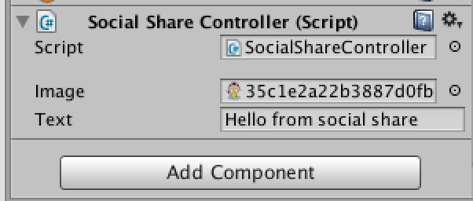
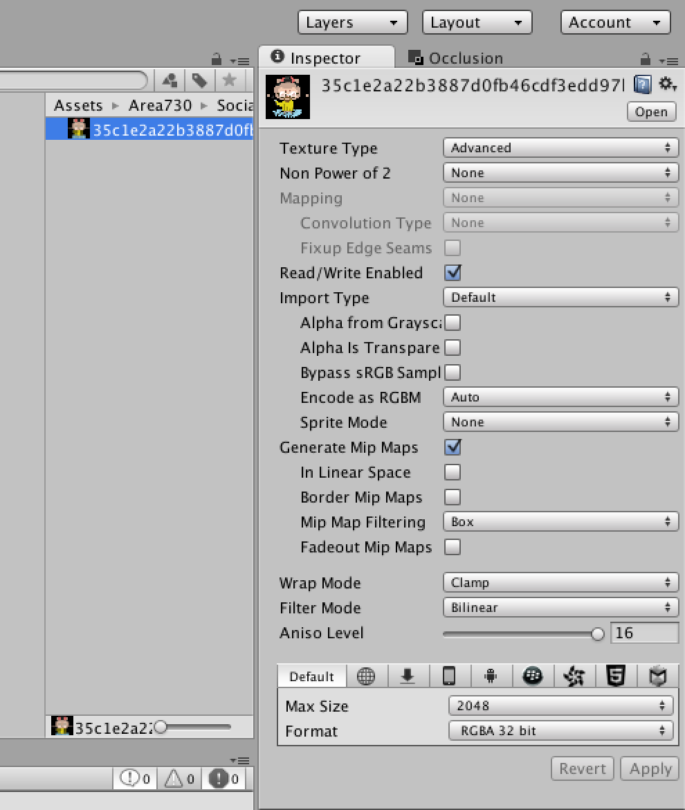

Integration
-----------

To start working with Mobile Social Share plugin you need to follow next steps:


1. Import it to your project

2. Add script ```SocialShareController``` to some gameobject in scene



3. Set up text and image that you want to share

4. Go to image options and check on Read/Write option



5. That is it, you are ready to share you game via social networks
